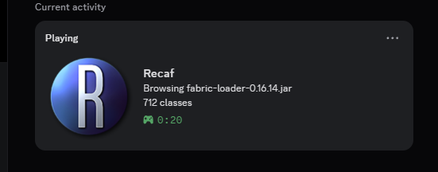
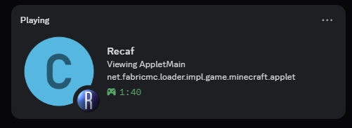
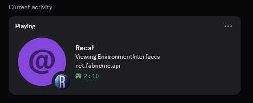
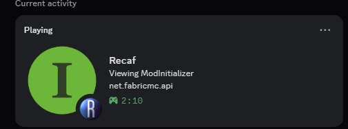

# Recaf Discord RPC

A [Recaf](https://github.com/Col-E/Recaf) plugin that adds **Discord Rich Presence**, showing your friends exactly what you're reverse‑engineering — the JAR you opened, the class you're reading, and the type of class it is.

<p align="center">
  
</p>

The presence updates live as you switch tabs, and an elapsed timer tracks your session from the moment Recaf launched.

---

## What it shows

The presence reflects whatever you're currently looking at:


| State                         | Details                              | Sub‑text                                        |
| ------------------------------- | -------------------------------------- | -------------------------------------------------- |
| **Idle** — no workspace open | `Idle`                               | `No workspace open`                              |
| **Workspace open**            | `Browsing fabric-loader-0.16.14.jar` | `712 classes`                                    |
| **Viewing a class**           | `Viewing AppletMain`                 | `net.fabricmc.loader.impl.game.minecraft.applet` |
| **Editing in the assembler**  | `Editing AppletMain`                 | `Bytecode assembler` / `Assembler · <member>`   |

When you open a class, the large icon switches to match the **type** of class, and the Recaf logo moves to the small badge:

<p align="center">
  
  
  
</p>

## Class‑type icons

Each class type gets its own color‑coded icon, mirroring Recaf's own conventions:

<table>
  <tr>
    <td align="center"><br><b>Class</b></td>
    <td align="center"><br><b>Abstract class</b></td>
    <td align="center"><br><b>Interface</b></td>
    <td align="center"><br><b>Enum</b></td>
    <td align="center"><br><b>Annotation</b></td>
  </tr>
</table>

## Building

The plugin builds with Gradle and requires **JDK 22+** (same as Recaf).

```bash
./gradlew build
```

The plugin jar is written to `build/libs/discord-rpc-1.0.0.jar`. Drop it into your Recaf `plugins` directory:


| OS      | Location                                      |
| --------- | ----------------------------------------------- |
| Windows | `%APPDATA%\Recaf\plugins`                     |
| Linux   | `~/.config/Recaf/plugins`                     |
| macOS   | `~/Library/Application Support/Recaf/plugins` |

Then start Recaf with Discord running. That's it — it's ready to use out of the box.

> You can also launch Recaf with the plugin already loaded straight from this project:
>
> ```bash
> ./gradlew runRecaf
> ```
